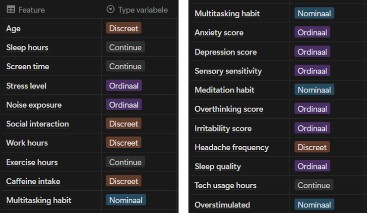

# Eindproject_overstimulation_and_lifestyle

Endproject for the module Advanced Programming &amp; Maths

## Project description

The project is about creating a client/server application that allows users to send and receive messages. The client is a GUI application that allows users to send messages to the server.

The dataset used in this project comes from Kaggle [Overstimulation Behavior and Lifestyle Dataset](https://www.kaggle.com/datasets/miadul/overstimulation-behavior-and-lifestyle-dataset?resource=download) and contains synthetic information about the behavior and lifestyle of individuals.



## Project structure
The project is structured as follows:
...

## Project Installation
### Step 1: Clone the repository to your local machine using the following command:
```sh
git clone https://github.com/vinnikalessia/Eindproject_overstimulation_and_lifestyle.git
cd Eindproject_overstimulation_and_lifestyle
```

### Step 2: Create a virtual environment (optional but recommended):
```sh
python -m venv .venv
```

For **Windows**:
```sh
venv\Scripts\activate
```

Or **macOS/Linux**:
```sh
source venv/bin/activate
```

### Step 3: Install the required dependencies using pip: 
```sh
pip install -r requirements.txt
```
### Step 4: Select a kernel in Jupyter Notebook
Before running the Jupyter Notebook, make sure to select the correct kernel that corresponds to your virtual environment. You can do this by clicking on "Kernel" in the Jupyter Notebook menu, then selecting "Change kernel" and choosing the appropriate kernel from the list.


Now you can run the Jupyter Notebook and start working with the code!

## Usage
...